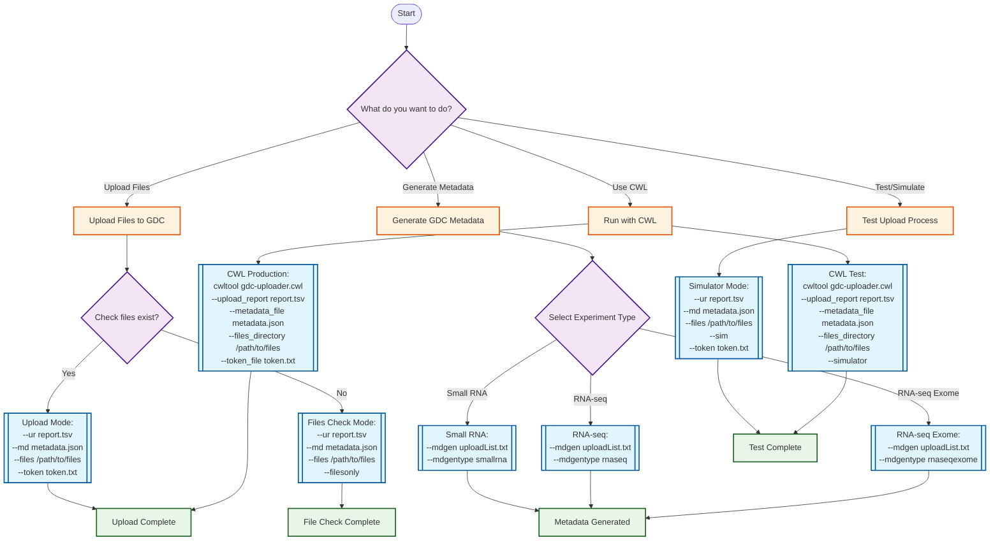

# GDC Uploader Usage Guide

## Tool Workflow Diagram



## Command Reference

### 1. File Upload (Production)
```bash
# Full upload with all options
dotnet /app/upload2gdc.dll \
  --ur ~/gdc-upload-report.tsv \      # Upload report from GDC
  --md ~/gdc-metadata-file.json \     # GDC metadata file
  --files /proj/seq/tracseq/delivery \ # Directory with files
  --token ~/token.txt \               # GDC auth token
  --threads 8 \                       # Thread count (default: 10)
  --retries 2 \                       # Retry count (default: 3)
  --multipart yes                     # Force multipart upload
```

### 2. File Verification (Dry Run)
```bash
# Check if all files in metadata exist without upload report
dotnet /app/upload2gdc.dll \
  --md metadata.json \
  --files /path/to/files \
  --filesonly

# Check with upload report (more detailed)
dotnet /app/upload2gdc.dll \
  --ur upload-report.tsv \
  --md metadata.json \
  --files /path/to/files \
  --filesonly
```

### 3. Testing with Simulator
```bash
# Test upload process without actually uploading
dotnet /app/upload2gdc.dll \
  --ur upload-report.tsv \
  --md metadata.json \
  --files /path/to/files \
  --token token.txt \
  --sim
```

### 4. Metadata Generation
```bash
# Generate metadata for different experiment types
# Small RNA
dotnet /app/upload2gdc.dll \
  --mdgen uploadList.txt \
  --mdgentype smallrna \
  --mdgendev  # Optional: use dev server

# RNA-seq
dotnet /app/upload2gdc.dll \
  --mdgen uploadList.txt \
  --mdgentype rnaseq

# RNA-seq Exome
dotnet /app/upload2gdc.dll \
  --mdgen uploadList.txt \
  --mdgentype rnaseqexome
```

### 5. Docker Usage
```bash
# Build image
docker build -t cgc-images.sbgenomics.com/david.roberson/gdc-utils:latest .

# Run upload (production)
docker run --rm \
  -v /local/data:/data \
  cgc-images.sbgenomics.com/david.roberson/gdc-utils:latest \
  /app/upload2gdc \
  --ur /data/upload-report.tsv \
  --md /data/metadata.json \
  --files /data \
  --token /data/gdc-token.txt

# Run file check only
docker run --rm \
  -v /local/data:/data \
  cgc-images.sbgenomics.com/david.roberson/gdc-utils:latest \
  /app/upload2gdc \
  --md /data/metadata.json \
  --files /data \
  --filesonly
```

## CWL Workflow Usage

### Upload Workflow (Production)
```bash
cwltool --outdir ./output cwl/gdc-uploader.cwl \
  --upload_report /path/to/upload-report.tsv \
  --metadata_file /path/to/metadata.json \
  --files_directory /path/to/files \
  --token_file /path/to/token.txt \
  --thread_count 4 \
  --retry_count 3
```

### Test Workflow (Simulator)
```bash
cwltool --outdir ./output cwl/gdc-uploader.cwl \
  --upload_report /path/to/upload-report.tsv \
  --metadata_file /path/to/metadata.json \
  --files_directory /path/to/files \
  --token_file /path/to/token.txt \
  --simulator \
  --thread_count 2
```

### File Check Workflow
```bash
cwltool --outdir ./output cwl/gdc-uploader.cwl \
  --upload_report /path/to/upload-report.tsv \
  --metadata_file /path/to/metadata.json \
  --files_directory /path/to/files \
  --files_only
```

### Using Test Data
```bash
# Run the included test script
cd tests
./test-cwl.sh

# Or run tests manually
cwltool --outdir /tmp/test-output ../cwl/gdc-uploader.cwl \
  --upload_report test-data/upload-report.tsv \
  --metadata_file test-data/gdc-metadata.json \
  --files_directory test-data \
  --files_only
```

## Key Options Explained

| Option | Description | Default | Required |
|--------|-------------|---------|----------|
| `--ur` | Upload report TSV file from GDC | - | Yes (except --filesonly mode) |
| `--md` | GDC metadata JSON file | - | Yes |
| `--files` | Directory containing files to upload | - | Yes |
| `--token` | GDC authentication token file | token.txt | Yes (except --filesonly/--sim) |
| `--threads` | Number of concurrent upload threads | 10 | No |
| `--retries` | Number of retry attempts for failed uploads | 3 | No |
| `--multipart` | Force multipart (yes/no) or auto (program) | yes | No |
| `--skip` | File containing UUIDs to skip | - | No |
| `--filesonly` | Only check if files exist, don't upload | false | No |
| `--sim` | Use simulator instead of real gdc-client | false | No |
| `--mdgen` | Generate metadata from upload list | - | No |
| `--mdgentype` | Experiment type (smallrna/rnaseq/rnaseqexome) | - | Yes with --mdgen |
| `--mdgendev` | Use GDC development server | false | No |
| `--log` | Directory for log files | auto-generated | No |
| `--verbose` | Print all messages to stdout | false | No |

## File Requirements

### Upload Report Format (TSV)
The upload report should be a tab-separated file with these columns:
- `id`: GDC UUID for the file
- `related_case`: Case identifier
- `entity_type`: Should be "submitted_unaligned_reads"
- `entity_id`: Entity identifier
- `entity_submitter_id`: Submitter ID (must match metadata)
- `file_size`: File size in bytes
- `file_md5`: MD5 checksum

### Metadata Format (JSON)
The metadata file should contain an array of objects with:
- `submitter_id`: Must match `entity_submitter_id` in upload report
- `file_name`: Actual filename to upload
- `file_size`: File size in bytes
- `md5sum`: MD5 checksum
- Additional GDC metadata fields

### File Organization
Files should be organized as:
```
files_directory/
├── fastq/           # For FASTQ files
│   ├── file1.fastq.gz
│   └── file2.fastq.gz
└── uBam/           # For BAM files
    └── run_id/
        ├── file1.bam
        └── file2.bam
```