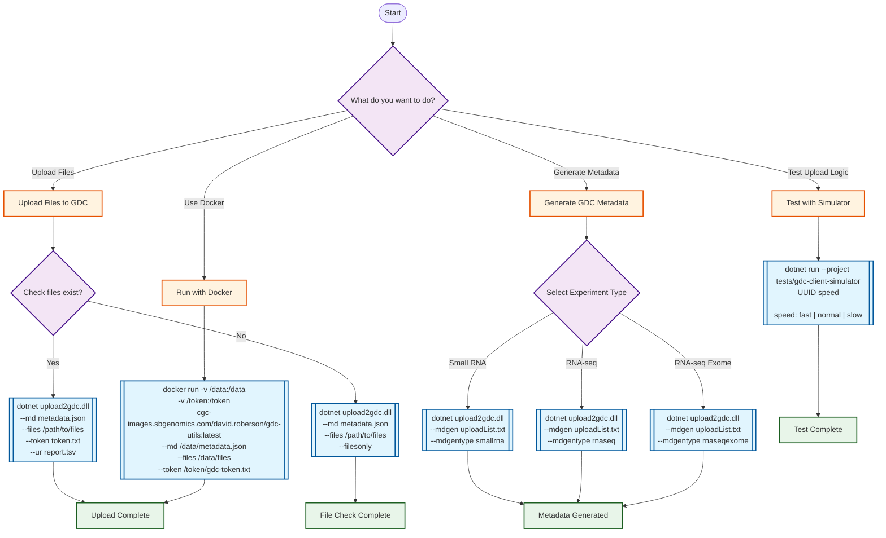

# GDC Uploader Usage Guide

## Tool Workflow Diagram



## Command Reference

### 1. File Upload
```bash
# Full upload with all options
dotnet src/upload2gdc/bin/Debug/net5.0/upload2gdc.dll \
  --ur ~/gdc-upload-report.tsv \      # Upload report output
  --md ~/gdc-metadata-file.json \     # GDC metadata file
  --files /proj/seq/tracseq/delivery \ # Directory with files
  --token ~/token.txt \               # GDC auth token
  --tc 8 \                            # Thread count (optional)
  --rc 2 \                            # Retry count (optional)
  --mp                                # Use multipart upload (optional)
```

### 2. File Verification (Dry Run)
```bash
# Check if all files in metadata exist
dotnet src/upload2gdc/bin/Debug/net5.0/upload2gdc.dll \
  --md metadata.json \
  --files /path/to/files \
  --filesonly
```

### 3. Metadata Generation
```bash
# Generate metadata for different experiment types
# Small RNA
dotnet src/upload2gdc/bin/Debug/net5.0/upload2gdc.dll \
  --mdgen uploadList.txt \
  --mdgentype smallrna \
  --mdgendev  # Optional: use dev server

# RNA-seq
dotnet src/upload2gdc/bin/Debug/net5.0/upload2gdc.dll \
  --mdgen uploadList.txt \
  --mdgentype rnaseq

# RNA-seq Exome
dotnet src/upload2gdc/bin/Debug/net5.0/upload2gdc.dll \
  --mdgen uploadList.txt \
  --mdgentype rnaseqexome
```

### 4. Docker Usage
```bash
# Build image
docker build -t cgc-images.sbgenomics.com/david.roberson/gdc-utils:latest .

# Run upload
docker run \
  -v /local/data:/data \
  -v /local/token:/token \
  cgc-images.sbgenomics.com/david.roberson/gdc-utils:latest \
  --md /data/metadata.json \
  --files /data/files \
  --token /token/gdc-token.txt \
  --ur /data/upload-report.tsv
```

### 5. Testing with Simulator
```bash
# Test upload logic with different speeds
dotnet run --project tests/gdc-client-simulator abc-123-def fast
dotnet run --project tests/gdc-client-simulator abc-123-def normal
dotnet run --project tests/gdc-client-simulator abc-123-def slow
```

## CWL Workflow Usage

### Upload Workflow
```bash
cwl-runner cwl/gdc-uploader.cwl upload-job.yml
```

Example `upload-job.yml`:
```yaml
metadata_file:
  class: File
  path: /path/to/metadata.json
files_directory:
  class: Directory
  path: /path/to/files
token_file:
  class: File
  path: /path/to/token.txt
thread_count: 8
retry_count: 2
```

### Metadata Generation Workflow
```bash
cwl-runner cwl/metadata-generator.cwl metadata-job.yml
```

Example `metadata-job.yml`:
```yaml
upload_list:
  class: File
  path: /path/to/uploadList.txt
experiment_type: smallrna
use_dev_server: false
```

## Key Options Explained

| Option | Description | Default |
|--------|-------------|---------|
| `--ur` | Upload report file path | Required |
| `--md` | GDC metadata JSON file | Required |
| `--files` | Directory containing files to upload | Required |
| `--token` | GDC authentication token file | Required |
| `--tc` | Number of concurrent upload threads | 4 |
| `--rc` | Number of retry attempts for failed uploads | 1 |
| `--mp` | Use multipart upload mode | false |
| `--sk` | Skip file containing UUIDs to skip | Optional |
| `--filesonly` | Only check if files exist, don't upload | false |
| `--mdgen` | Generate metadata from upload list | Optional |
| `--mdgentype` | Type of experiment (smallrna/rnaseq/rnaseqexome) | Required with --mdgen |
| `--mdgendev` | Use GDC development server | false |