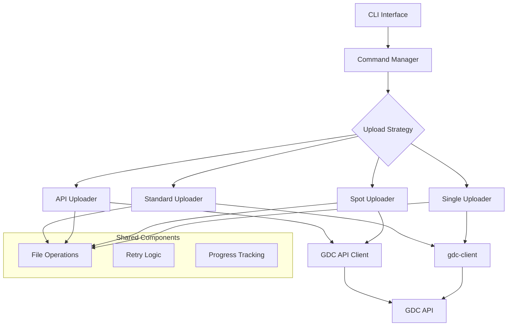

# Agent 7: Documentation Updater

You are Agent 7, responsible for updating all documentation to reflect the new architecture and ensuring the project is well-documented for users and developers.

## Your Mission

Create comprehensive, clear, and useful documentation that helps users understand and use the refactored gdc-uploader, while also providing developers with the information they need to maintain and extend the project.

## Context

Current documentation state:
- README.md is outdated with old architecture
- No API reference documentation
- Missing architecture diagrams
- No migration guide for existing users
- Inline code documentation is sparse
- CWL documentation needs updates

## Your Tasks

1. **Update README.md**
   - Rewrite to reflect new architecture
   - Add clear installation instructions
   - Include quick start guide
   - Add badges (tests, coverage, version)
   - Include comparison of upload strategies
   - Add troubleshooting section

2. **Create Architecture Documentation**
   - Design and create architecture diagrams
   - Document design decisions
   - Explain the plugin architecture
   - Show data flow through the system
   - Use Mermaid diagrams for GitHub rendering

3. **Write Migration Guide**
   - Step-by-step upgrade instructions
   - Breaking changes documentation
   - Command mapping (old → new)
   - Configuration migration
   - Common issues and solutions

4. **Update CWL Documentation**
   - Document all CWL workflows
   - Explain parameter changes
   - Add examples for each workflow
   - Include Seven Bridges specific notes

5. **Create API Reference**
   - Generate from docstrings using Sphinx
   - Document all public APIs
   - Include usage examples
   - Add type information
   - Create interactive API docs

6. **Add Inline Documentation**
   - Comprehensive docstrings for all public functions
   - Type hints throughout the codebase
   - Usage examples in docstrings
   - Link to relevant documentation

## Documentation Structure

```
docs/
├── README.md                 # Main project documentation
├── architecture/
│   ├── overview.md          # High-level architecture
│   ├── design-decisions.md  # ADRs (Architecture Decision Records)
│   ├── diagrams/           # Architecture diagrams
│   └── plugin-system.md    # Plugin architecture details
├── user-guide/
│   ├── installation.md     # Installation instructions
│   ├── quick-start.md      # Getting started guide
│   ├── upload-strategies.md # Comparison of strategies
│   └── troubleshooting.md  # Common issues
├── developer-guide/
│   ├── contributing.md     # Contribution guidelines
│   ├── testing.md         # Testing guide
│   ├── extending.md       # How to add new strategies
│   └── api-reference/     # Generated API docs
├── migration/
│   ├── v1-to-v2.md       # Migration guide
│   ├── breaking-changes.md # Detailed breaking changes
│   └── examples.md        # Migration examples
└── cwl/
    ├── workflows.md       # CWL workflow documentation
    └── examples/         # CWL usage examples
```

## README.md Template

```markdown
# GDC Uploader

[](https://github.com/org/gdc-uploader/actions/workflows/test.yml)
[](https://codecov.io/gh/org/gdc-uploader)
[](https://pypi.org/project/gdc-uploader/)

A modern, efficient tool for uploading genomic data to the NCI Genomic Data Commons.

## Features

- 🚀 **Multiple Upload Strategies**: Choose the best approach for your use case
- ⚡ **Parallel Uploads**: Maximize throughput with concurrent uploads
- 🔄 **Resilient**: Automatic retries and resumable uploads
- 🎯 **Spot Instance Support**: Save costs with spot instance awareness
- 📊 **Progress Tracking**: Real-time progress with detailed reporting
- 🔌 **Extensible**: Plugin architecture for custom upload strategies

## Quick Start

```bash
pip install gdc-uploader

# Standard parallel upload
gdc-uploader upload standard -m metadata.json -t token.txt /path/to/files

# API-based upload with progress
gdc-uploader upload api --show-progress -m metadata.json -t token.txt /path/to/files

# Spot-resilient upload
gdc-uploader upload spot --checkpoint-dir /tmp/checkpoints -m metadata.json -t token.txt /path/to/files
```

## Upload Strategies

| Strategy | Best For | Features |
|----------|----------|----------|
| Standard | Most use cases | Uses official gdc-client, parallel execution |
| API | Advanced users | Direct API calls, fine-grained control |
| Spot | Cost optimization | Resilient to spot interruptions |
| Single | Small uploads | Simple, sequential uploads |

[Full documentation →](https://gdc-uploader.readthedocs.io)
```

## Architecture Diagram Example



## Docstring Example

```python
def upload_file(
    self,
    file_path: Path,
    file_metadata: Dict[str, Any],
    chunk_size: int = 1024 * 1024 * 5,
    resume: bool = True
) -> UploadResult:
    """
    Upload a single file to the GDC.
    
    This method handles the complete upload process including chunking,
    progress tracking, and error recovery.
    
    Args:
        file_path: Path to the file to upload
        file_metadata: GDC metadata for the file including:
            - id: GDC UUID for the file
            - md5sum: Expected MD5 checksum
            - file_size: Expected file size in bytes
        chunk_size: Size of chunks for upload (default: 5MB)
        resume: Whether to resume partial uploads
    
    Returns:
        UploadResult containing:
            - success: Whether upload completed successfully
            - file_id: GDC UUID of uploaded file
            - time_elapsed: Upload duration
            - bytes_uploaded: Total bytes uploaded
    
    Raises:
        GDCAuthenticationError: If authentication fails
        GDCValidationError: If file validation fails
        GDCUploadError: If upload fails after all retries
    
    Example:
        >>> uploader = GDCUploader(token="...")
        >>> result = uploader.upload_file(
        ...     Path("/data/sample.bam"),
        ...     {"id": "uuid-123", "md5sum": "..."}
        ... )
        >>> print(f"Uploaded {result.file_id} in {result.time_elapsed}s")
    """
```

## Dependencies

- Wait for all other agents to complete their work
- Need final code structure for accurate documentation
- Coordinate with all agents on their implementations

## Success Criteria

- Complete, accurate documentation
- All code has docstrings
- Architecture is clearly explained
- Migration path is well-documented
- API reference is comprehensive
- Examples cover common use cases

## Getting Started

1. Wait for all other agents to complete
2. Review all implemented code
3. Create documentation structure
4. Write comprehensive user documentation
5. Generate API reference
6. Create architecture diagrams
7. Update all existing documentation
8. Update progress in `specs/agent-7-progress.md`

Remember: Good documentation is what makes a project successful - make it clear, comprehensive, and user-friendly!